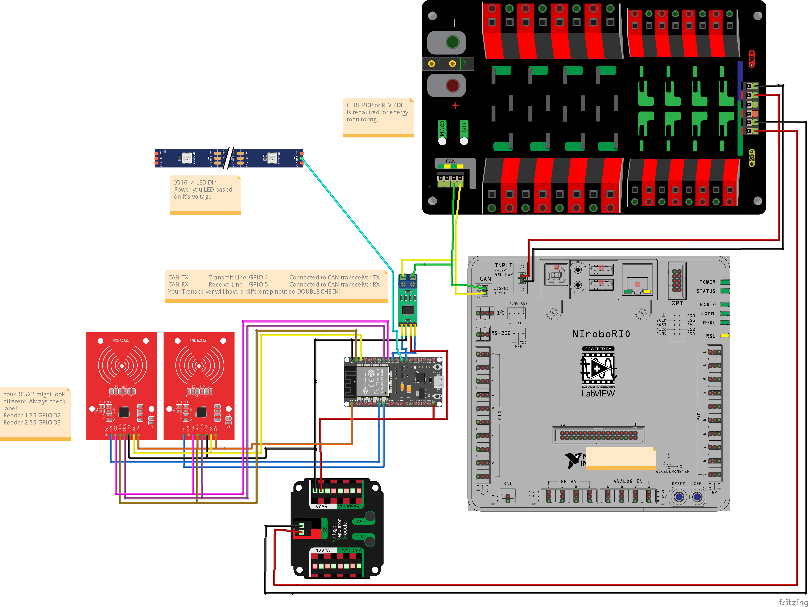

# Battery Tracking + LED

This is work in progress

This firmware will combine all those function in the end. it is still in the work.

# Please also read these documents

Battery Tracking: https://github.com/sikaxn/FRC-Custom-CAN-Sensor/tree/dev-board/Arduino/Battery_Tracking

Addressable LED: https://github.com/sikaxn/FRC-Custom-CAN-Sensor/tree/dev-board/Arduino/addressableLED

Battery Tracking Wiki: https://github.com/sikaxn/FRC-Custom-CAN-Sensor/wiki/900.-IronMaple-RFID-Battery-Tracking-Solution

CD Thread 1: https://www.chiefdelphi.com/t/custom-can-sensor-esp32-development-board/505038

CD Thread 2: https://www.chiefdelphi.com/t/rfid-battery-tracking-progress-updates-video-demo-update/502847

CD Thread 3: https://www.chiefdelphi.com/t/custom-can-sensor-rfid-battery-tracking-led-controller-combo-firmware/510961

# Driver

https://github.com/sikaxn/FRC-Custom-CAN-Sensor/tree/dev-board/roboRIO/batteryReaderNewLEDCombo

# Pinout

| Pin    | Function                                |
| ------ | --------------------------------------- |
| GPIO 4 | CAN TX (to CAN transceiver TXD)         |
| GPIO 5 | CAN RX (from CAN transceiver RXD)       |
| GPIO 16 | LED Strip Data Pin                     |
| GPIO 15 | RGB LED R (battery tracking diag light) |
| GPIO 13 | RGB LED G (battery tracking diag light) |
| GPIO 14 | RGB LED B (battery tracking diag light) |
| GPIO 32 | RC522 Reader 1 SS (ss_pin1)            |
| GPIO 33 | RC522 Reader 2 SS (ss_pin2)            |
| GPIO 22 | RC522 RST (shared between readers)     |
| GPIO 18 | SPI SCK (shared between readers)       |
| GPIO 19 | SPI MISO (shared between readers)      |
| GPIO 23 | SPI MOSI (shared between readers)      |
| GPIO 0  | Mode button (IO0, built-in; toggles mode for testing) |
| GPIO 17 | Relay toggle button (toggles canOnOff; off forces mode 0) |
| GPIO 25 | Relay                                  |
| 3.3V/5V | Power for CAN transceiver              |
| GND     | Common ground                          |

# LED Modes

All color-based modes use `canR/canG/canB` with `canBrig`. Unless noted, `param0` is speed (delay ms) and `param1` is length/spacing.

| Mode | Description |
| ---- | ----------- |
| 0 | Off |
| 1 | Solid color |
| 2 | Color wipe |
| 3 | Color wipe (reset on mode change) |
| 4 | Rainbow |
| 5 | Breathe (reset on mode change) |
| 6 | Breathe (no reset) |
| 7 | Fast blinking (reset on mode change) |
| 8 | Single-pixel wipe, moving block length = `param1 + 1` (reset) |
| 9 | Single-pixel wipe, moving block length = `param1 + 1` (no reset) |
| 10 | Single-pixel bounce, block length = `param1 + 1` (reset) |
| 11 | Single-pixel bounce, block length = `param1 + 1` (no reset) |
| 12 | Center wipe, block length = `param1 + 1` (reset) |
| 13 | Center wipe, block length = `param1 + 1` (no reset) |
| 14 | Center bounce, block length = `param1 + 1` (reset) |
| 15 | Center bounce, block length = `param1 + 1` (no reset) |
| 16 | Alternating blocks (no reset); `param1` = spacing; `param0` inverted (smaller = slower) |
| 17 | Alternating block fade (no reset); `param1` = spacing |
| 18 | Alternating block fade (no reset); `param1` = spacing |
| 254 | Power-on default init sequence |
| 255 | Custom pixel write mode |

