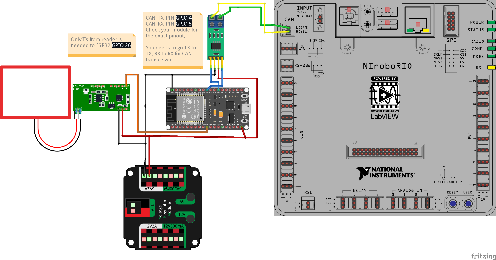

# Battery Tracking using LF EM4xxx RFID

This is a simple and low-cost battery identification system that uses LF (Low Frequency) 125 kHz EM4xxx-compatible tags such as EM4100 or EM4200, together with an RDM6300 serial RFID reader module.

Unlike the full IronMaple Battery Tracking Solution that uses HF NFC (13.56 MHz) tags with JSON-based BEST data format, this approach is purely for identification, not for logging or writing data. It can be easily integrated into the robot’s control system or pit equipment where simple read-only ID functionality is sufficient.

# STOP! Compatibility warning!

**This system is not, and will never be, compatible with the Iron Maple Battery Tracking ecosystem or the FRC Battery Reader App. The incompatibility is due to fundamental differences in technology. To function correctly, the reader and tag type must match exactly (RDM6300 ↔ EM4xxx family); mixing LF modules with HF tags or vice versa will not work.**

## Limitations

* Read-only — cannot store metadata (like charge cycles or notes).

* Not compatible with phones or NFC readers.

* Each tag’s ID is fixed and must be managed manually.

# Required Equipment

* RDM6300 LF RFID Reader Module
* EM4100 / EM4200 Tag
* ESP32 Development Board
* CAN Transceiver Module (TJA1051)
* Power Supply (Buck converter) for ESP32

# Wiring

# ESP32 Online Flasher

TBD

# roboRIO Driver

https://github.com/sikaxn/FRC-Custom-CAN-Sensor/tree/dev-board/roboRIO/batteryReaderLF

# GPIO

| **Symbol**    | **GPIO Pin**              | **Direction**       | **Function / Description**                                                                     |
| ------------- | ------------------------- | ------------------- | ---------------------------------------------------------------------------------------------- |
| `RFID_RX_PIN` | **GPIO 26**               | Input               | UART RX — receives data from **RDM6300** (reader TX → ESP32 RX)                                |
| `RFID_TX_PIN` | **GPIO 34**               | Output *(optional)* | UART TX — unused, safe to leave unconnected.                                                   |
| `LED_G`       | **GPIO 13**               | Output              | **Green LED** — indicates **tag present**                                                      |
| `LED_B`       | **GPIO 14**               | Output              | **Blue LED** — used for CAN-bus error blink                                                    |
| `LED_R`       | **GPIO 15**               | Output              | **Red LED** — combined with green to form **yellow** (“no tag”)                                |
| `CAN_TX_PIN`  | **GPIO 4** (`GPIO_NUM_4`) | Output              | **TWAI TX** — transmits CAN frames to bus via transceiver (e.g., TJA1051)                      |
| `CAN_RX_PIN`  | **GPIO 5** (`GPIO_NUM_5`) | Input               | **TWAI RX** — receives CAN frames from bus via transceiver                                     |

# CAN Protocol

| API ID | Direction | Purpose                                       | Payload                    |
| ------ | --------- | --------------------------------------------- | -------------------------- |
| `0x10` | Rio → ESP | Reboot request                                | `[0x01]` (one byte)        |
| `0x11` | ESP → Rio | First 8 bytes of tag serial                   | `[S0..S7]`                 |
| `0x12` | ESP → Rio | Last 6 bytes of tag serial + status + counter | `[S8..S13][status][count]` |

