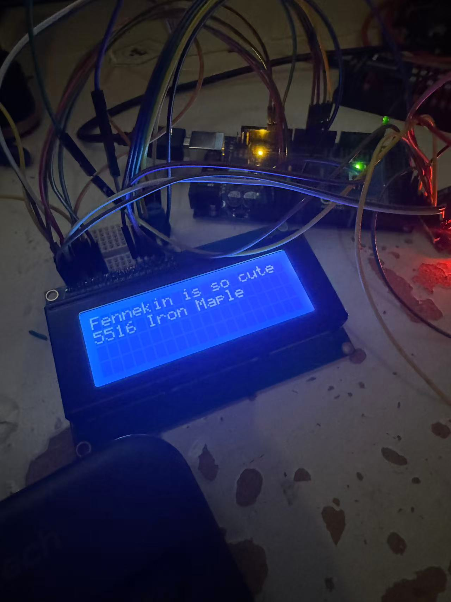

## 🔌 CAN Message Structure



Each CAN message sent to the LCD follows this 8-byte payload format:

```
Byte 0 : CMD         → Command type (write, clear, etc.)
Byte 1 : isFinal     → 1 if this is the last chunk of a logical message
Byte 2 : row         → LCD row number (0 to 3)
Byte 3 : col         → LCD column (0 to 19)
Byte 4 : char1       → ASCII character 1 (or 0-padded if not used)
Byte 5 : char2       → ASCII character 2
Byte 6 : char3       → ASCII character 3
Byte 7 : tid         → Transaction ID for ACK
```

## 🧠 Supported Commands

| CMD  | Description              | Action on Arduino                   |
| ---- | ------------------------ | ----------------------------------- |
| 0x01 | `CMD_CLEAR`              | Clears the LCD screen               |
| 0x02 | `CMD_CURSOR`             | Sets the cursor (not often used)    |
| 0x03 | `CMD_WRITE`              | Writes 3 chars at specified pos     |
| 0x04 | `CMD_WRITE_NEXT`         | Writes 3 more chars at current pos  |
| 0xAA | `CMD_ACK` (Arduino only) | Sent as a response for confirmation |

---

## 🔄 How It Works

### Sending

1. **GUI splits text into lines** (by `\n`) and each line into 3-byte chunks.
2. For each chunk:

   * It sends a `CMD_WRITE` for the first chunk with cursor position.
   * It sends `CMD_WRITE_NEXT` for subsequent chunks.
   * Last chunk sets `isFinal = 1`.
3. Each message includes a random `tid` (transaction ID).

### Receiving (Arduino side)

1. Checks if the message ID matches the expected CAN ID.
2. Decodes the command and writes characters to the LCD.
3. When it receives the final chunk (`isFinal == 1`), it sends an ACK:

   * Same base CAN ID with API ID `0x188`
   * Payload: `[CMD_ACK, tid]`

---


## 📋 Example

To send `"abcde"` on row 0:

* Frame 1: `[CMD_WRITE, 0, 0, 0, 'a', 'b', 'c', tid]`
* Frame 2: `[CMD_WRITE_NEXT, 1, 0, 0, 'd', 'e', ' ', tid]`

Arduino will:

* Print `"abcde"` starting at (0, 0)
* Send back `[CMD_ACK, tid]` with CAN ID using `API_ID = 0x188`

---

