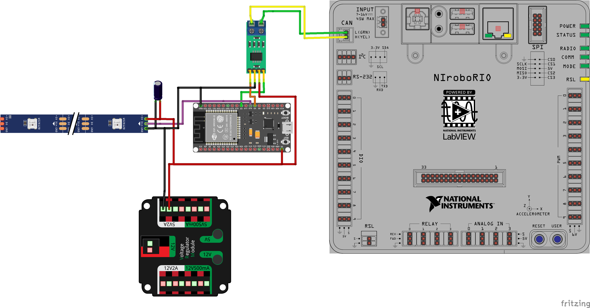

# 🧾 Addressable LED CAN

For 2026 build season our team will be focusing on Addressable LED + RFID combo firmware. This one might be slightly out dated. 

Combo Firmware: https://github.com/sikaxn/FRC-Custom-CAN-Sensor/tree/dev-board/Arduino/BatteryLEDCombo

Video: https://www.youtube.com/watch?v=yBTm1w7MFy0

Addressable LED controller using an ESP32 connected to the FRC CAN bus.
Tested with WS2812-compatible LED. If your LED support [FastLED](https://github.com/FastLED/FastLED/wiki/Chipset-reference), it should work. 

---

## 🔌 Wiring

### **ESP32 Connections**

WLED documentation have great resource about how to wire LED to ESP32. It is strongly recommended that you check it out even this code had nothing to do with WLED.
https://kno.wled.ge/basics/getting-started/


| Pin       | Function                                                 |
| --------- | -------------------------------------------------------- |
| GPIO 4    | CAN TX (to CAN transceiver TXD)                          |
| GPIO 5    | CAN RX (from CAN transceiver RXD)                        |
| GPIO 16   | LED Strip Data Pin                                       |
| GPIO 0    | Mode button (IO0, built-in; toggles mode for testing)    |
| 3.3V / 5V | Power for CAN transceiver and LEDs (depends on hardware) |
| GND       | Common ground                                            |

### **CAN Transceiver**

Use a transceiver such as **TJA1051** to connect the ESP32 TWAI (CAN) interface to the FRC CAN bus.

* **CANH** and **CANL** connect to the FRC CAN bus.
* **TXD / RXD** connect to ESP32 TX (GPIO 4) / RX (GPIO 5).

---

## 💡 LED Configuration (FastLED Setup)

The following defines and variables configure the **NeoPixel (WS2812B) LED strip** used by the ESP32:

```cpp
// —— LED Configuration ——
const uint16_t NUM_LEDS = 140;    // Total number of addressable LEDs in the strip
CRGB          leds[NUM_LEDS];    // FastLED pixel buffer (each LED is a CRGB object)

#define DATA_PIN    16           // GPIO pin used to drive the LED data line
#define BRIGHTNESS  128          // Default FastLED brightness (0–255)
#define LED_TYPE    WS2812B      // Type of LED strip
#define COLOR_ORDER GRB          // Color channel order used by the LED (Green, Red, Blue)
```

### 🔧 Explanation

| Setting       | Description                                                                                                     |
| ------------- | --------------------------------------------------------------------------------------------------------------- |
| `NUM_LEDS`    | Number of LEDs on the strip. Set this to match your physical hardware.                                          |
| `leds[]`      | The buffer array holding all LED color values. Use `leds[i] = CRGB(r, g, b);` to modify individual pixels.      |
| `DATA_PIN`    | ESP32 GPIO pin connected to the LED strip's **data** line. Must be an output-capable pin.                       |
| `BRIGHTNESS`  | Global brightness limiter used by FastLED. This does **not** modify individual `CRGB` values.                   |
| `LED_TYPE`    | Specifies the LED protocol. `WS2812B` is the common choice for NeoPixel strips.                                 |
| `COLOR_ORDER` | Defines the order in which color channels are sent. Most WS2812B strips use `GRB`. Some may use `RGB` or `BRG`. |

### 📝 Notes

* The `leds` buffer is passed to FastLED via:

  ```cpp
  FastLED.addLeds<LED_TYPE, DATA_PIN, COLOR_ORDER>(leds, NUM_LEDS);
  ```
* You must call `FastLED.show();` after modifying the buffer to apply changes.
* To dim the entire strip, use either `FastLED.setBrightness(...)` or scale each `CRGB` color with `.nscale8_video()`.


---

## 🧮 CAN Data Format

The system uses the standard **FRC CAN extended 29-bit identifier** format:

```
CAN_ID = (deviceID << 24) | (manufacturerID << 16) | (apiID << 6) | (deviceNumber & 0x3F)
```

### Fixed Identifiers

| Field             | Value                    |
| ----------------- | ------------------------ |
| deviceID          | `0x0A`                   |
| manufacturerID    | `0x08`                   |
| deviceNumber      | Configurable (e.g. `33`) |
| GENERAL\_API (ID) | `0x350`                  |
| CUSTOM\_API       | `0x351` to `0x358`       |
| FEEDBACK\_API     | `0x359`                  |
| TOTAL\_PIXEL\_API | `0x360`                  |

---

### 🚦 General LED Command (API ID `0x350`)

| Byte | Field      | Description              |
| ---- | ---------- | ------------------------ |
| 0    | Mode       | LED Mode (0–255)         |
| 1    | Red        | 0–255                    |
| 2    | Green      | 0–255                    |
| 3    | Blue       | 0–255                    |
| 4    | Brightness | Max brightness (0–255)   |
| 5    | On/Off     | 1 = on, 0 = off          |
| 6    | Param0     | Effect speed or option 1 |
| 7    | Param1     | Effect-specific option 2 |

Example:

```
Mode 3 (Color wipe), color red, full brightness, speed=20
[3, 255, 0, 0, 128, 1, 20, 0]
```

---

### 🎯 Custom Pixel Write (`API ID 0x351` to `0x358`)



You can send up to 8 pixel updates per loop using separate CAN IDs. Mode 255 must be set first to allow custom pixel drawing.

| Byte | Field       | Description         |
| ---- | ----------- | ------------------- |
| 0-1  | Pixel Index | High byte, Low byte |
| 2    | Red         | 0–255               |
| 3    | Green       | 0–255               |
| 4    | Blue        | 0–255               |
| 5    | White       | Not used (set to 0) |
| 6    | Brightness  | 0–255               |
| 7    | Reserved    | Should be 0         |


---

### 🔁 Feedback Frame (API ID `0x359`)

The ESP32 sends back status at \~50Hz.

| Byte | Field          | Description |
| ---- | -------------- | ----------- |
| 0-1  | Number of LEDs |             |
| 2    | Current Mode   |             |
| 3-7  | Reserved       |             |

---

### 🔢 Total Pixel Count (API ID `0x360`)

Set the active LED count without reflashing. The firmware clamps the value to the compiled maximum.

| Byte | Field          | Description |
| ---- | -------------- | ----------- |
| 0-1  | Number of LEDs | Big-endian  |
| 2-7  | Reserved       | Set to 0    |

---

## 💡 LED Modes

All color-based modes use `canR/canG/canB` with `canBrig`. Unless noted, `param0` is speed (delay ms) and `param1` is length/spacing.

| Mode | Description |
| ---- | ----------- |
| 0 | Off |
| 1 | Solid color |
| 2 | Color wipe |
| 3 | Color wipe (reset on mode change) |
| 4 | Rainbow |
| 5 | Breathe (reset on mode change) |
| 6 | Breathe (no reset) |
| 7 | Fast blinking (reset on mode change) |
| 8 | Single-pixel wipe, moving block length = `param1 + 1` (reset) |
| 9 | Single-pixel wipe, moving block length = `param1 + 1` (no reset) |
| 10 | Single-pixel bounce, block length = `param1 + 1` (reset) |
| 11 | Single-pixel bounce, block length = `param1 + 1` (no reset) |
| 12 | Center wipe, block length = `param1 + 1` (reset) |
| 13 | Center wipe, block length = `param1 + 1` (no reset) |
| 14 | Center bounce, block length = `param1 + 1` (reset) |
| 15 | Center bounce, block length = `param1 + 1` (no reset) |
| 16 | Alternating blocks (no reset); `param1` = spacing; `param0` inverted (smaller = slower) |
| 17 | Alternating block fade (no reset); `param1` = spacing |
| 18 | Alternating block fade (no reset); `param1` = spacing |
| 254 | Power-on default init sequence |
| 255 | Custom pixel write mode |

---

## 🎨 Adding a New Custom Mode

To add a new mode, you only need to:

### ✅ Step 1: Reserve a `canMode` number

Pick a mode ID not used yet, e.g. `7`.

---

### ✅ Step 2: Add a `case` in `mode.cpp`

Edit the `runCurrentMode()` function:

```cpp
case 7: {
  if (modeRefresh) {
    animation_index = 0;
    modeRefresh = false;
  }
  animation_index = yourNewPatternStep(CRGB{canR, canG, canB}, canParam0, animation_index);
  break;
}
```

> Use `modeRefresh` to reset the pattern cleanly when a new setting is received.

---

### ✅ Step 3: Create the pattern in `pattern.cpp`

In `pattern.cpp`, define the function:

```cpp
uint16_t yourNewPatternStep(const CRGB& color, uint8_t speed, uint16_t frame) {
  // Example: simple flash every 10 frames
  bool on = (frame / speed + 1) % 2 == 0;
  fill_solid(leds, NUM_LEDS, on ? color : CRGB::Black);
  FastLED.show();
  return frame + 1;
}
```

Also declare it in `pattern.h`:

```cpp
uint16_t yourNewPatternStep(const CRGB& color, uint8_t speed, uint16_t frame);
```

## ✅ Tips

* Use `canParam0` as effect speed — small = slow, large = fast.
* Use `FastLED.show()` only when needed to avoid flickering.
* If adding effects with more logic, ensure **non-blocking code** (use `frame`-based progress).

---


## ⚠️ Be Careful When Using Mode 255

**Mode 255** enables **direct per-pixel control** of the LED strip over CAN using `0x351` to `0x358`.

While this provides **maximum flexibility** (such as full animation control from the roboRIO or a Python script), it also comes with significant tradeoffs:

### ❗ CAN Traffic Warning

* **Each pixel update** is sent as a full 8-byte CAN frame.
* At **60+ FPS**, even updating 60 LEDs requires:

  * \~8 frames per update (via 8 slots: `0x351`–`0x358`)
  * ×60 = **480 CAN messages per second**
* This can **overload the FRC CAN bus**, potentially affecting other devices like motor controllers, PDP, and sensors.

### ✅ Recommended Usage

* Use Mode 255 only when **absolutely necessary** (e.g. for precise animations synced to music or effects).
* If possible, offload animation logic to the **ESP32** using built-in modes (`canMode = 1..254`) and just adjust `canParam0`, `canParam1`, or RGB over CAN.
* When writing from Python or roboRIO:

  * Avoid sending all 8 messages unless needed.
  * Add a delay (`sleep(0.01~0.05)`) between batches.
  * Reduce update rate to 10–20Hz when possible.


# Serial command for setting CAN Device Number  

Under this setup, CAN device number can be setted using serial command. This setting will be saved inside ESP32 and will not be overwritten, even if you flushed the firmware. The only way to clear it is use ESPTool to erase flash.

https://randomnerdtutorials.com/esp32-erase-flash-memory/


### `&CANID SET <number>`

Sets the active `DEVICE_NUMBER` (in RAM only).
Must be a value from `0` to `63`.

####  Example:

```
&CANID SET 12
```

####  Response:

```
[CANID] Running DEVICE_NUMBER set to 12
```

---

### `&CANID SAVE`

Saves the current `DEVICE_NUMBER` to EEPROM and reboots the device.

####  Example:

```
&CANID SAVE
```

####  Response:

```
[CANID] Saved to EEPROM. Rebooting...
```

---

### `&CANID GET`

Prints the current runtime `DEVICE_NUMBER`, the value stored in EEPROM, and the default hardcoded value.
