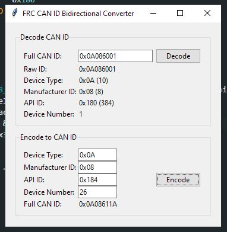
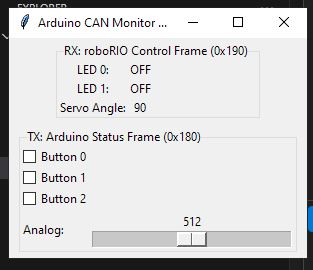

# Custom CAN sensor with roboRIO

## ChiefDelphi Thread
https://www.chiefdelphi.com/t/custom-can-sensor-some-good-progress/501764

## Video

Potentiometer analog input
https://www.youtube.com/watch?v=bEm6USGRP-E

LED (pin 13) digital output
https://www.youtube.com/shorts/q937u09llhw

roboRIO heartbeat (look at the LED blinking while enabled)
https://www.youtube.com/shorts/c1ieu9o8Lzo

## ⚠️ Disclaimer

This project is **for demo and under work**. Faulty CAN frame could bring entire CAN bus down. 

This project use **AI generated content**. 

---
## Update

1. REVCOlourSensorV3 Arduino sketch has been updated to do conversion in code. In addition, rm_dt7 is added to handle Robomaster / DJI DT7 Remote with DR16. This is not legal to use in FRC. However you could still take a look at these conversion. 

```
// === CAN Constants ===
#define DEVICE_ID        0x0A  //DONOT CHANGE
#define MANUFACTURER_ID  0x08  //DONOT CHANGE
#define DEVICE_NUMBER    33  // Device Number 0-63
#define STATUS_API_ID        0x180
#define COLOR_SENSOR_API_ID  0x184
#define CONTROL_API_ID       0x190
#define DT7_API1_ID          0x185
#define DT7_API2_ID          0x186
#define DT7_API3_ID          0x187
#define HEARTBEAT_ID         0x01011840

uint32_t makeCANMsgID(uint8_t deviceID, uint8_t manufacturerID, uint16_t apiID, uint8_t deviceNumber) {
  return ((uint32_t)(deviceID & 0xFF) << 24) |
         ((uint32_t)(manufacturerID & 0xFF) << 16) |
         ((uint32_t)(apiID & 0x3FF) << 6) |
         (deviceNumber & 0x3F);
}
```
2. An ID converter script is added. see below for usage.

3. DO NOT change DEVICE_ID and MANUFACTURER_ID as this will result roboRIO code stop working. 

---

---

# 📄 FRC-Arduino CAN Protocol & Hardware Pin Assignment

## 🧭 Overview

This document describes the **CAN protocol** used between an Arduino Mega (with MCP2515) and a roboRIO, and outlines the **hardware pin assignments** needed for the connection.

Only roboRIO CAN work with this project. Please do not connect Arduino to CTRE CANivore. I don't know what will happen if you try to do so. 

---
**Message ID Generator GUI Tool**

A minimal Tkinter application for converting between FRC 29-bit CAN IDs and their four fields.




### Features

* **Decode**: Enter a full CAN ID (hex or decimal) and see:

  * Device Type (bits \[28:24])
  * Manufacturer ID (bits \[23:16])
  * API/Message ID (bits \[15:6])
  * Device Number (bits \[5:0])
* **Encode**: Enter those four values to get the full 29-bit CAN ID.


### Conversion Logic

```python
# Decode:
def decode_id(id):
    return (
      (id>>24)&0xFF,   # device type
      (id>>16)&0xFF,   # manufacturer
      (id>>6)&0x3FF,   # api
      id&0x3F          # device number
    )

# Encode:
def encode_id(dt, man, api, dn):
    return (dt<<24)|(man<<16)|(api<<6)|dn
```

---

### Example

* **Decode** `0x0A086003` → `(0x0A, 0x08, 0x180, 3)`
* **Encode** `(0x0A, 0x08, 0x184, 2)` → `0x0A086102`

---


# 📄 Python Arduino Simulator 



This Python simulator emulates an Arduino CAN device on the FRC CAN bus using a **CANalyst-II adapter** and the `python-can` library. It interacts with the roboRIO using standard 29-bit extended CAN frames, following FRC-style protocol structure.

---

## 🔧 Hardware Requirements

* **CANalyst-II USB CAN adapter**
* Properly terminated FRC CAN bus (with roboRIO on the same network)

---

## 🧰 Python Dependencies

Install via pip:

```bash
pip install python-can
```

This simulator provides a reliable way to **test and debug the roboRIO-side CAN code** without needing real Arduino hardware, while faithfully simulating:

* Button input
* Analog data
* LED control
* Servo updates


---

## 🔌 Hardware Setup

### ✅ Arduino Board

* **Model:** Arduino Mega 2560

### ✅ CAN Interface

* **Module:** MCP2515 CAN Controller with TJA1050 transceiver
* **Crystal:** 8 MHz
* **Bus speed:** 1 Mbps

### 🧷 Pin Assignments

| Component     | Arduino Mega Pin | Description                     |
| ------------- | ---------------- | ------------------------------- |
| MCP2515 CS    | D53              | SPI Chip Select (manual)        |
| MCP2515 INT   | D2               | CAN message interrupt (FALLING) |
| SPI MOSI      | D51              | SPI data out                    |
| SPI MISO      | D50              | SPI data in                     |
| SPI SCK       | D52              | SPI clock                       |
| Servo Signal  | D9               | PWM output                      |
| External LED0 | D6               | Controlled by control frame     |
| External LED1 | D7               | Controlled by control frame     |
| Built-in LED  | D13              | Mirrors LED0                    |
| Button 0      | D3               | Status input (pulled up)        |
| Button 1      | D4               | Status input (pulled up)        |
| Button 2      | D5               | Status input (pulled up)        |
| Analog Input  | A0               | 10-bit ADC (0–1023)             |

> 💡 Ensure MCP2515 `CAN_H` and `CAN_L` are connected to a terminated CAN bus (120Ω at each end).

---

## 📡 CAN Protocol Specification

The Arduino and roboRIO communicate using **FRC-compatible 29-bit CAN identifiers**.

### 🧭 Identifier Layout (FRC Style)

| Field        | Bits | Arduino Value      |
| ------------ | ---- | ------------------ |
| Device Type  | 5    | 0x0A (Misc)        |
| Manufacturer | 8    | 0x08 (Team Use)    |
| API ID       | 10   | `0x180` or `0x190` |
| Device ID    | 6    | 0x00               |

### 📨 CAN Messages

#### 1. **Control Frame** (roboRIO → Arduino)

| Field      | Value             |
| ---------- | ----------------- |
| CAN ID     | `0x0A086400`      |
| Frame Type | Extended (29-bit) |
| Direction  | roboRIO → Arduino |

##### Payload:

| Byte | Meaning                                  |
| ---- | ---------------------------------------- |
| 0    | LED bitmask (bit 0 = LED0, bit 1 = LED1) |
| 1    | Servo angle (0–180)                      |
| 2–7  | Reserved (0)                             |

#### 2. **Status Frame** (Arduino → roboRIO)

| Field      | Value             |
| ---------- | ----------------- |
| CAN ID     | `0x0A086000`      |
| Frame Type | Extended (29-bit) |
| Direction  | Arduino → roboRIO |

##### Payload:

| Byte | Meaning                                             |
| ---- | --------------------------------------------------- |
| 0    | Button bitmask (bit 0 = B0, bit 1 = B1, bit 2 = B2) |
| 1    | Analog high byte                                    |
| 2    | Analog low byte                                     |
| 3–7  | Reserved (0)                                        |

---

## 🧰 Software Design

### 🧠 Real-Time Architecture (FreeRTOS)

| Task             | Function                               |
| ---------------- | -------------------------------------- |
| `TaskCANSend`    | Send status frame every 100 ms         |
| `TaskCANReceive` | Decode control frames on interrupt     |
| `TaskPrint`      | Print LED state changes (rate-limited) |

* `CAN_INT` triggers an ISR → signals `TaskCANReceive`
* LED state changes are queued to `TaskPrint` to avoid serial delay in ISR

---

## 🧪 Debugging Tips

* Use a CAN analyzer or another CAN node to verify `0x0A086400` is received
* Watch for Serial output like:

  ```
  LED0: ON
  LED1: OFF
  ```

---

## ✅ Summary

* Protocol uses **standard FRC 29-bit CAN frame format**
* Direction:

  * roboRIO sends control → `0x0A086400`
  * Arduino sends status → `0x0A086000`
* MCP2515 is configured for **1 Mbps / 8 MHz**, driven by interrupt
* All print and GPIO handling is offloaded to RTOS tasks for reliability


---

# 🟢 Color Sensor CAN Protocol — `0x184`


## ✅ Pinout & Wiring

| Sensor Pin | Connect To (Arduino Mega) | Notes                |
| ---------- | ------------------------- | -------------------- |
| **SDA**    | **Pin 20**                | I²C data             |
| **SCL**    | **Pin 21**                | I²C clock            |
| **GND**    | **GND**                   | Ground               |
| **3.3V**   | **3.3V**                  | **Use 3.3V only** ⚠️ |

> ⚠️ **Important:** The REV Color Sensor V3 is a 3.3V device.
> **Do not connect it to 5V** — it may damage the sensor.

---


## ✅ Overview

This protocol sends color data from an Arduino to the roboRIO using CAN ID `0x184`.

It is used with the REV Color Sensor V3 connected via I²C.

---

## 🛠 CAN Frame Info

* **CAN ID**: `0x184` (standard 11-bit)
* **Length**: 8 bytes

### 🔢 Data Format

| Byte | Data         | Description                     |
| ---- | ------------ | ------------------------------- |
| 0-1  | Red (16-bit) | High + low byte of red value    |
| 2-3  | Green        | High + low byte of green value  |
| 4-5  | Blue         | High + low byte of blue value   |
| 6    | Proximity    | Proximity reading (0–255)       |
| 7    | IR           | High byte of IR value (low-res) |

---

## ⚠️ Fault Condition

If the sensor is disconnected, the Arduino sends:

```
Byte 0 = 0xFF
```

All other bytes are ignored. The roboRIO should mark the sensor as disconnected.


---

## 🔁 Update Rate

* Sent by Arduino every 100 ms
* Reconnects automatically if sensor is unplugged and replugged

