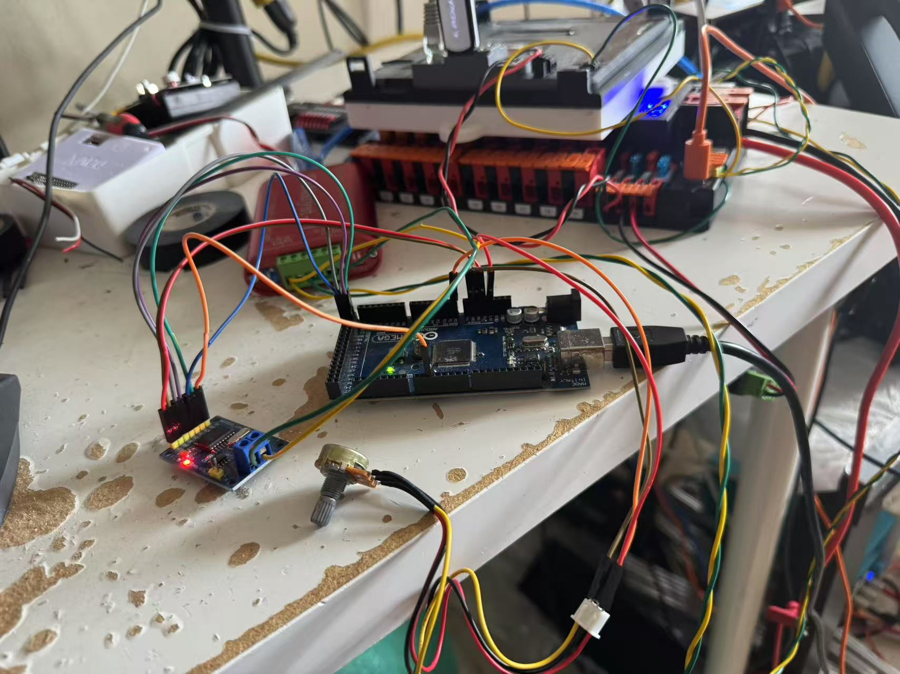

# Custom CAN sensor with roboRIO

## ChiefDelphi Thread
https://www.chiefdelphi.com/t/custom-can-sensor-some-good-progress/501764

## Video

Potentiometer analog input
https://www.youtube.com/watch?v=bEm6USGRP-E

LED (pin 13) digital output
https://www.youtube.com/shorts/q937u09llhw

roboRIO heartbeat (look at the LED blinking while enabled)
https://www.youtube.com/shorts/c1ieu9o8Lzo


## ⚠️ Disclaimer

This project is **for demo and under work**. Faulty CAN frame could bring entire CAN bus down. 

This project use **AI generated content**. 

---
# Demos:

1. Digital Analog bi-directional ([Docs](Arduino/readme.md) / [Arduino Firmware](Arduino/Digital_Analog/) / [roboRIO](roboRIO/can-test/) / [RIO Simulator](scripts/ADrioSIm.py))
2. REV Colour sensor  ([Docs](Arduino/readme.md) / [Arduino Firmware](Arduino/REVColourSensorV3/) / [roboRIO](roboRIO/can-test/)) (this share the same roboRIO code with the first one)
3. LCD Screen  ([Arduino Firmware](Arduino/LCD/) / [roboRIO](roboRIO/can-LCD/) / [RIO Simulator](scripts/LCDSendRIOSIM.py))
4. Robomaster motor gateway (dual CAN on ESP32)  ([Arduino Firmware](Arduino/RM_stuff/) / [roboRIO](roboRIO/djimotor/))
5. Robomaster DT7 Remote on CAN  ([Arduino Firmware](Arduino/RM_stuff/) / [roboRIO](roboRIO/dt7/))
---
## How FRC CAN bus works

The 'CAN ID' we talked about when setting up motor controllers (Spark, Kraken, PDP, etc) is a number from 0-63. This is not the CAN identifier (message ID) used in CAN data layer. FRC Use a very specific scheme outlined in FRC CAN specification to convert certain information to CAN identifier. All device connected to roboRIO must follow this scheme when determine what ID to send data to and read form.

https://docs.wpilib.org/en/stable/docs/software/can-devices/can-addressing.html#requirements-for-frc-can-nodes

CAN identifier is calculated from device ID (device type ID), manufacturer ID, API ID (in the documentation it talked about API Class and Index but doesn't matter and it is just a suggestion. Each device will have its unique API ID designed for its use) and device number (0-63 as the traditional 'CAN ID' we talked about in FRC). 

You must generate your CAN identifier (message ID) using this very specific way. A device will have multiple CAN message sent to and from roboRIO (and possibly to other non-roboRIO device). These different messages will share the same device type ID, manufacturer ID and device number. API ID will change based on use. 

---
## Update

1. REVCOlourSensorV3 Arduino sketch has been updated to do conversion in code. In addition, rm_dt7 is added to handle Robomaster / DJI DT7 Remote with DR16. This is not legal to use in FRC. However you could still take a look at these conversion. 

```
// === CAN Constants ===
#define DEVICE_ID        0x0A  //DONOT CHANGE
#define MANUFACTURER_ID  0x08  //DONOT CHANGE
#define DEVICE_NUMBER    33  // Device Number 0-63
#define STATUS_API_ID        0x180
#define COLOR_SENSOR_API_ID  0x184
#define CONTROL_API_ID       0x190
#define HEARTBEAT_ID         0x01011840

uint32_t makeCANMsgID(uint8_t deviceID, uint8_t manufacturerID, uint16_t apiID, uint8_t deviceNumber) {
  return ((uint32_t)(deviceID & 0xFF) << 24) |
         ((uint32_t)(manufacturerID & 0xFF) << 16) |
         ((uint32_t)(apiID & 0x3FF) << 6) |
         (deviceNumber & 0x3F);
}
```
2. An ID converter script is added. see below for usage.

3. DO NOT change DEVICE_ID and MANUFACTURER_ID as this will result roboRIO code stop working. 

---

---

## **Message ID Generator GUI Tool**

A minimal Tkinter application for converting between FRC 29-bit CAN IDs and their four fields.


---
